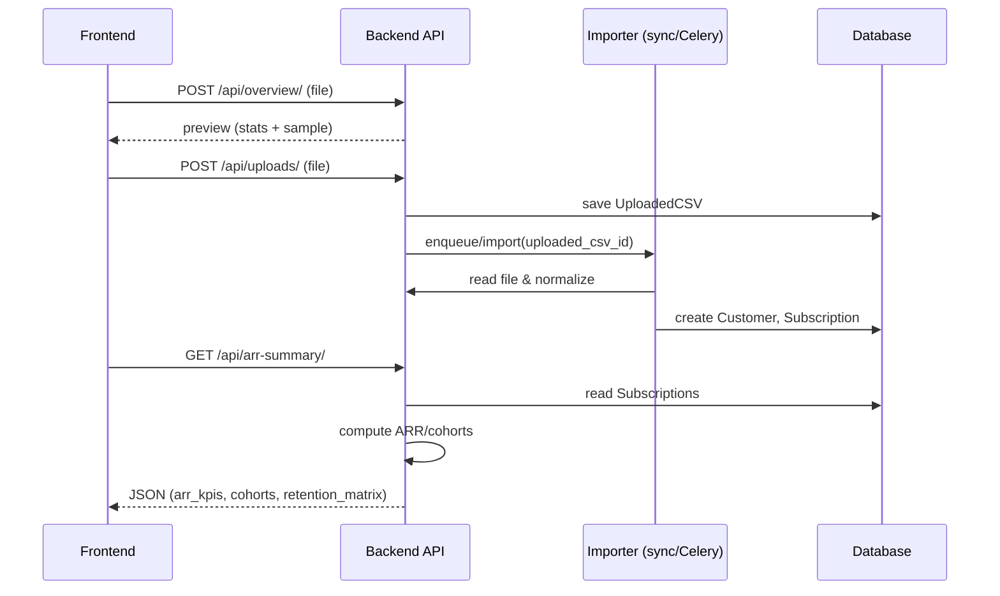

## Jarvis360 — ARR Dashboard Process Flow

This document records the end-to-end process flow for the ARR (Annual Recurring Revenue) dashboard
implemented in the Jarvis360 project. It ties together CSV ingestion, normalization, persistence,
ARR/cohort calculation utilities, APIs used by the frontend, and background work (import tasks).

### Overview (high level)
- User uploads a CSV via the frontend Dashboard/Upload UI (POST to `/api/uploads/` via `UploadCSVAPIView`).
- The uploaded file is saved as an `UploadedCSV` model instance (fields: `org`, `uploaded_by`, `file`, `filename`, `created_at`).
- The import pipeline reads `UploadedCSV.file`, normalizes rows (via `analysis.normalize.normalize_csv_text`),
  and creates `Customer` and `Subscription` records in the DB.
- The dashboard reads canonical `Subscription` rows to compute MRR/ARR and top customers (`analysis.arr`),
  and uses the `analysis.cohorts` utilities to cohort and build a retention matrix.
- The frontend calls `ARRSummaryAPIView` to fetch the KPIs, top customers, cohorts, and retention matrix.

---

### Key models and data shapes
- `UploadedCSV` (api.models)
  - org: FK Organization
  - uploaded_by: FK User
  - file: FileField
  - filename: str
  - created_at: datetime

- `Customer` (api.models)
  - org: FK Organization
  - external_id: str (nullable)
  - name: str

- `Subscription` (api.models)
  - customer: FK Customer
  - mrr: Decimal (12,2)
  - start_date: Date
  - source_upload: FK UploadedCSV

- Normalized in-memory record produced by normalize_csv_text:
  - { 'customer_id': str|None, 'mrr': float, 'signup_date': date|None, 'raw': dict }

---

### Ingestion & normalization (detailed)
1. Frontend uploads CSV to `UploadCSVAPIView` (ListCreate endpoint) with `CookieTokenAuthentication`.
2. `UploadCSVAPIView.perform_create` ensures the request user has a `UserProfile` with an `org`, then saves the `UploadedCSV` record.
3. Import pipeline (synchronous or background):
   - `api.importer.import_single_upload(upload: UploadedCSV)` reads `upload.file` into a UTF-8 string.
   - Calls `analysis.normalize.normalize_csv_text(raw_text, sample_lines=...)` which:
     - Uses pandas to parse CSV robustly (fallback to python engine if needed).
     - Heuristically detects columns for id, amount (mrr), and date using lower-cased column name matching.
     - Cleans numeric values using `_clean_amount` (removing currency symbols and commas).
     - Parses dates with `pd.to_datetime(..., errors='coerce')` and yields Python `date` objects where parse succeeds.
     - Returns a list of records: {customer_id, mrr, signup_date, raw}.
   - For each normalized record the importer:
     - Looks up or creates a `Customer` using `external_id` and `org` (defaults the customer name from available fields).
     - Creates a `Subscription` row with `mrr`, `start_date`, and `source_upload`.
   - `import_single_upload` returns the number of subscriptions created.

Notes:
- The importer is intentionally simple and idempotency is seeded by using `external_id` and `org` when creating customers. If CSVs don't provide stable identifiers, duplicates may occur.

---

### Background tasks and signals
- The project has been instrumented so imports can run in Celery (development friendly with eager mode). Look for any post-save signals or a task wrapper (search `import_uploaded_csv_task` if present).
- For reliable production imports, run importer via an asynchronous Celery task with retries and error handling (the codebase contains demo scripts under `scripts/` demonstrating retries).

---

### ARR calculation & cohorts
- Functions in `analysis/arr.py`:
  - `compute_mrr_and_arr(records)` — sums `mrr` across records and returns {'MRR': total_mrr, 'ARR': total_mrr * 12}.
  - `top_customers_by_mrr(records, limit=10)` — aggregates MRR per customer_id and returns top-N.

- Functions in `analysis/cohorts.py`:
  - `cohortize(signup_dates)` — buckets signup dates to (year, month) -> count.
  - `retention_matrix(signup_dates_and_active_months)` — builds retention counts per cohort given (signup_date, active_months) tuples.

How ARRSummaryAPIView uses them (api.views.ARRSummaryAPIView):
1. Determine `qs` of `UploadedCSV` rows for the user's org.
2. Attempt to use canonical `Subscription` rows when available:
   - Build `records = [{'customer_id': ..., 'mrr': float(s.mrr), 'signup_date': s.start_date}, ...]` from DB rows.
   - `kpis = compute_mrr_and_arr(records)`
   - `tops = top_customers_by_mrr(records)`
3. Fallback: if `Subscription` rows are not available, parse recent `UploadedCSV` files with `normalize_csv_text` to build `records`.
4. Build cohorts and retention matrix using `cohortize` and `retention_matrix`.
5. Return JSON:
   - arr_kpis: {MRR, ARR}
   - top_customers: [ {customer_id, mrr}, ... ]
   - cohorts: { 'YYYY-MM': count, ... }
   - retention_matrix: { 'YYYY-MM': [counts ...], ... }

---

### API endpoints relevant to the dashboard
- POST `/api/uploads/` (UploadCSVAPIView) — upload CSVs for an org (requires authentication via cookie token).
- GET `/api/arr-summary/` (ARRSummaryAPIView) — returns KPIs, top customers, cohorts, and retention matrix.
- POST `/api/overview/` (OverviewAPIView) — ad-hoc descriptive stats and sample chart from an uploaded file (used for preview before saving).

---

### Frontend interactions (client)
- On the client, users typically:
  1. Choose a CSV and use the Overview preview (`/api/overview/`) to inspect stats and chart previews.
  2. Upload the CSV to `/api/uploads/` which persists the file and (optionally) triggers an import job.
  3. Visit the ARR dashboard which calls `/api/arr-summary/` to get KPIs and cohort data.
  4. The frontend displays MRR/ARR, top customers table, cohort counts, and retention heatmap.

---

### Error handling and edge cases
- CSV parsing errors: `normalize_csv_text` falls back to the python engine and returns an empty list on failure — the importer skips creating rows in that case.
- Missing IDs: when CSVs lack stable identifiers, `Customer` creation uses available name or a synthetic id; this may cause duplicates.
- Large files: current importer reads files into memory; for very large uploads consider streaming processing or chunked CSV parsing.

---

### Testing and developer notes
- Unit tests should cover:
  - `normalize_csv_text` heuristics for different header variations and malformed rows.
  - `import_single_upload` creating customers and subscriptions (including org scoping).
  - `compute_mrr_and_arr`, `top_customers_by_mrr`, `cohortize`, and `retention_matrix` logic.
- Playwright E2E: the client tests for cookie-based auth should exercise the upload and dashboard read flows in sequence.

---

### Next improvements / TODOs
- Make importer idempotent for duplicate uploads (e.g., deduplicate by `source_upload` + stable external ids).
- Convert importer to a streaming parser for large files.
- Add a Celery task that enqueues `import_single_upload` with retry/backoff and record import statuses on the `UploadedCSV` model.
- Expose import status via the Upload serializer so the frontend can show progress/errors.

---

File references (for maintainers)
- Normalization: `analysis/normalize.py`
- ARR/cohort utilities: `analysis/arr.py`, `analysis/cohorts.py`
- Importer: `api/importer.py` (function `import_single_upload`)
- Models: `api/models.py` (UploadedCSV, Customer, Subscription)
- Dashboard API: `api/views.py` (class `ARRSummaryAPIView`)

---

## Quick sequence (developer-friendly)
1. User selects CSV in frontend -> client requests preview via `POST /api/overview/` (file multipart/form-data).
2. Client shows preview (stats + sample) and user confirms upload.
3. Client `POST /api/uploads/` to save `UploadedCSV` (server stores file on disk/media).
4. Importer runs (synchronously on save or by an async Celery task) and:
   - reads `UploadedCSV.file` into memory,
   - normalizes rows via `normalize_csv_text`,
   - creates/gets `Customer` rows and inserts `Subscription` rows linked to the upload.
5. Dashboard UI calls `GET /api/arr-summary/` which reads `Subscription` rows (preferred) or parses recent `UploadedCSV` files to compute KPIs and cohorts.
6. Client renders MRR/ARR, top customers, cohorts, and retention matrix.

### ASCII sequence (for quick mental model)

Frontend -> POST /api/overview/ -> Server (preview) -> Frontend
Frontend -> POST /api/uploads/ -> Server (save UploadedCSV) -> Importer [sync or Celery task]
Importer -> creates Customer, Subscription rows
Frontend -> GET /api/arr-summary/ -> Server -> reads Subscription rows -> analysis.arr / analysis.cohorts -> JSON response

### Mermaid sequence (visual)



If your Markdown viewer does not render Mermaid diagrams, you can generate an SVG/PNG locally:

```powershell
# From repo root (Windows PowerShell)
powershell -ExecutionPolicy Bypass -File docs/render_mermaid.ps1 -source docs/arr_sequence.mmd -outdir docs -formats svg,png
```

This will create `docs/arr_sequence.svg` and `docs/arr_sequence.png` which you can embed in the markdown for non-Mermaid viewers:


---

## Example requests and responses

Preview (Overview) request (multipart/form-data):

```bash
# curl example - preview
curl -X POST "http://127.0.0.1:8000/api/overview/" \
  -H "Authorization: Bearer <access-token>" \
  -F "file=@/path/to/my.csv"
```

ARR summary response (example):

```json
{
  "arr_kpis": { "MRR": 12000.0, "ARR": 144000.0 },
  "top_customers": [ {"customer_id": "cust_123", "mrr": 5000.0}, {"customer_id": "cust_456", "mrr": 3000.0} ],
  "cohorts": { "2025-07": 12, "2025-08": 8 },
  "retention_matrix": { "2025-07": [12, 9, 7], "2025-08": [8, 6] }
}
```

Notes: `arr_kpis.MRR` is a float monthly run-rate; `ARR` is `MRR * 12` by convention in this project.

---

## Quick "try it" developer commands

Run importer for an upload from Django shell (useful for local/manual runs):

```powershell
# Activate venv and open Django shell
& venv\Scripts\Activate.ps1
python manage.py shell
# then in the shell:
from api.models import UploadedCSV
from api.importer import import_single_upload
u = UploadedCSV.objects.filter(org__slug='my-org-slug').order_by('-created_at').first()
print('Running import for upload', u)
print(import_single_upload(u))
```

Run a simple curl request to fetch the dashboard summary (cookie auth example):

```bash
# If you use cookie auth, first authenticate and capture cookies (example uses login-cookie)
curl -c cookies.txt -X POST http://127.0.0.1:8000/api/login-cookie/ -H 'Content-Type: application/json' -d '{"username":"devuser","password":"devpass"}'
# Then request the summary using the saved cookies
curl -b cookies.txt http://127.0.0.1:8000/api/arr-summary/
```

---

## Testing notes (recommended unit + e2e targets)
- Unit tests:
  - `test_normalize_various_headers` — ensure `normalize_csv_text` maps common header names to `customer_id`, `mrr`, and `signup_date`.
  - `test_import_single_upload_creates_customers_and_subscriptions` — verify importer creates DB rows and ties them to `UploadedCSV.org`.
  - `test_cohort_and_retention_matrix` — feed sample signup_date/active_months and assert expected matrices.

- E2E (Playwright):
  - Auth flow: ensure cookie-based login works and sets access/refresh/auth_token cookies.
  - Upload flow: preview -> upload -> wait for import (or mock task) -> call /api/arr-summary and assert KPIs are present.

---

If you'd like, I can now:
- add a small sequence diagram image or mermaid block to this doc,
- implement import-status tracking on `UploadedCSV` and a Celery task that flips status fields (importing/complete/error), or
- run Playwright e2e to exercise the full upload -> import -> dashboard flow and collect failing traces.
